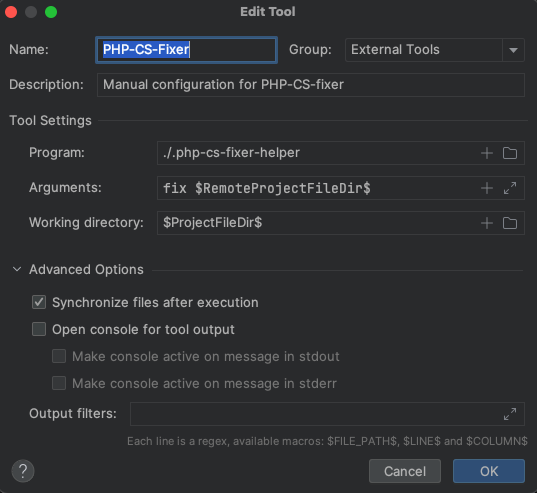

# Get php-cs-fixer running within docker for PHPStorm

<!-- TOC -->
* [Quality Tools setup](#quality-tools-setup)
* [External Tools setup](#external-tools-setup)
* [PHPStorm bug with setting "Synchronize files after execution"](#phpstorm-bug-with-setting--synchronize-files-after-execution-)
<!-- TOC -->

In PHPStorm two independent parts have to be set up correctly to get full
php-cs-fixer support working. One to mark code which has to be fixed, and
another to apply changes written to the file. And to get things working
within docker some particularities have to be considered.

## Quality Tools setup

Note! Settings within the PHP node are project specific. This does not apply to the External Tools settings, which
will be discussed below.

To set up the code validation is the easy part:


Click the three dots left to "Show ignored files" and configure the 
Docker interpreter. There is a good description about this configuration
<a href="https://ddev.readthedocs.io/en/latest/users/topics/phpstorm/">
on the DDEV documentation website</a>.

## External Tools setup

As mentioned above, settings within the External Tools configuration apply to all projects. This is a real shame and
discussed for years here: [Jetbrains bug tracker](https://youtrack.jetbrains.com/issue/IDEA-120007/External-Tools-configuration-cant-be-saved-as-project-level-settings).
So we have to find a solution which will work for several projects, not only the currently opened one.

Create a new entry in Settings -> Tools -> External Tools:



... where "Program:" shows the path to a file we have to create in the root directory of the current project, with the following content:

```
#!/bin/bash
/usr/local/bin/docker exec container-name /usr/bin/php vendor/friendsofphp/php-cs-fixer/php-cs-fixer --config=.php-cs-fixer.php "$@"
```

Change paths according to your project. As you can see we use paths that can easily apply for any project. The custom
paths are located within the external file (.php-cs-fixer-helper) and can be changed for the particular project.

Here comes the first banana skin. It looks like php-cs-fixer can not be run with docker compose.
Use docker exec, followed by the name of the docker container!<br>
Alternatively you can also use DDEV if applicable:

```
#!/bin/bash
ddev exec -s web php vendor/friendsofphp/php-cs-fixer/php-cs-fixer --config=.php-cs-fixer.php "$@"
```

Save this file and enter the path to the file in the "Program:"-field 
shown above (... ./.php-cs-fixer-helper). _Don't forget to make this file
executable!_

In the "Arguments:"-field use a variable to tell PHPStorm to run php-cs-fixer just for the current file:
```
fix $RemoteProjectFileDir$
```

The working directory should read ``` $ProjectFileDir$ ```

That's it. You can create a shortcut to run php-cs-fixer. It's located
here: 


## PHPStorm bug with setting "Synchronize files after execution"

Unfortunately the setting "Synchronize files after execution" is not
working as intended. So if you hit the shortcut to run the external tool,
nothing will happen, though php-cs-fixer did his job. But as we
let php-cs-fixer change the file within docker, PHPStorm doesn't 
recognize any changes, as long as we don't synchronize the current file.
As a workaround this command can be bound to a shortcut close to the
external tool we did before. Let's say we use option-shift-f for the 
php-cs-fixer and bind "Reload all from disk" to option-shift-g, the
changed file can be quickly synchronized after applying php-cs-fixer.